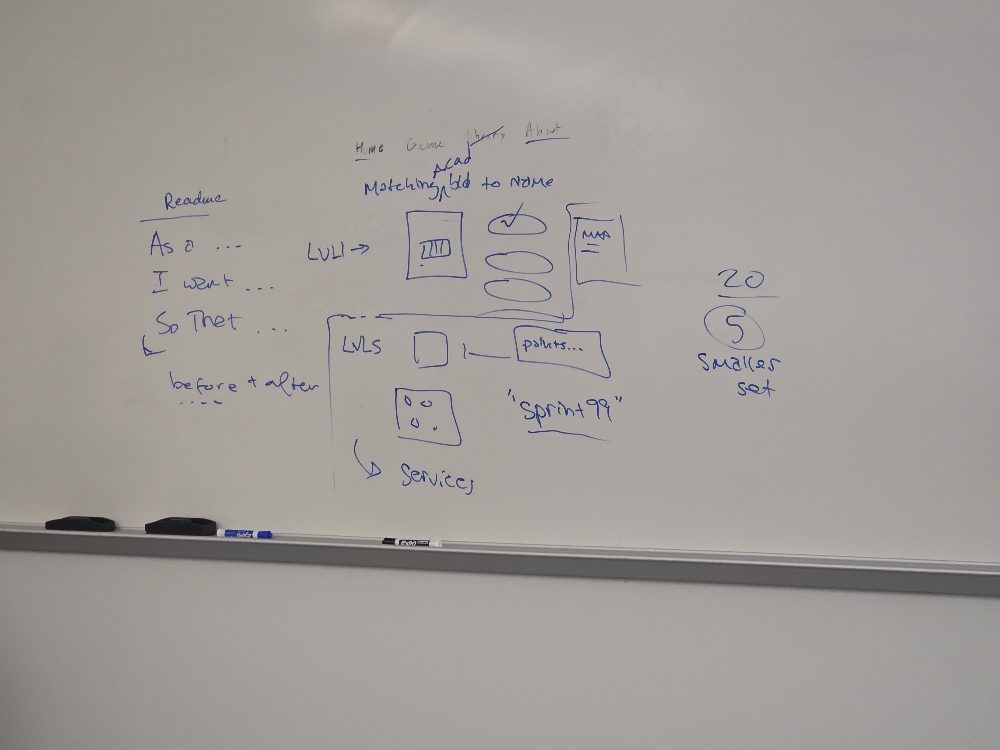

# una-building-matching-game
CIS 376 Spring Honors and Midterm Project
UNA building matching game using HTML, CSS, and JavaScript.
Created by Carina Estrada. Resources include: Bootstrap 5, w3schools,Google, Medium, TutorialsPoint, StackOverflow, Barrycumbie github, Youtube, Copilot, Codeacademy, MDN Web Docs, GeeksforGeeks
## It will be fun, informative, and engaging. It will be multipage and contain logic.
As a student at UNA, I want to be familiar with the academic buildings, so that I can know where my classes are and be more familiar with campus.
### Repository link tested on mobile + desktop: 
https://github.com/carinanestrada/una-building-matching-game/
Model sketch of una matching game: 

Code explanation:
